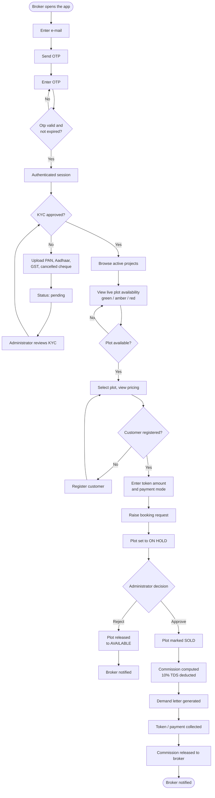
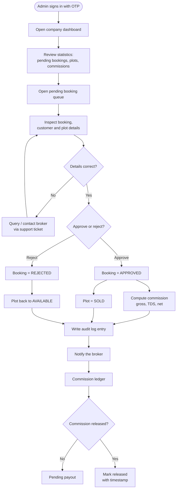
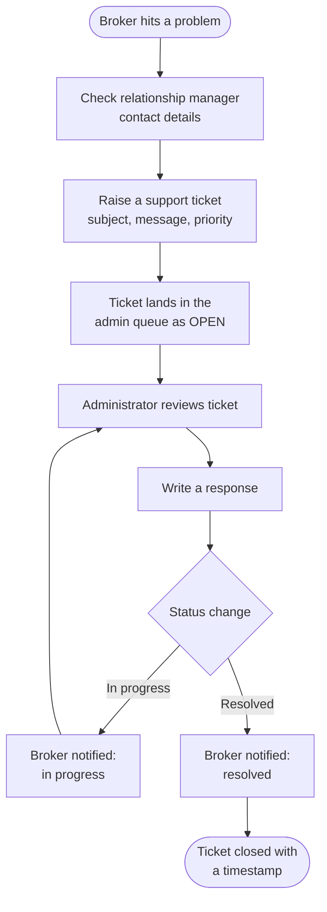

# Activity Diagrams

## 1. Broker onboarding and booking lifecycle

```mermaid
flowchart TD
    Start([Broker opens the app]) --> Email[Enter e-mail]
    Email --> OtpSent[Send OTP]
    OtpSent --> EnterOtp[Enter OTP]
    EnterOtp --> Valid{Otp valid and<br/>not expired?}
    Valid -- No --> EnterOtp
    Valid -- Yes --> LoggedIn[Authenticated session]

    LoggedIn --> KycDone{KYC approved?}
    KycDone -- No --> UploadKyc[Upload PAN, Aadhaar,<br/>GST, cancelled cheque]
    UploadKyc --> Pending[Status: pending]
    Pending --> AdminReview[Administrator reviews KYC]
    AdminReview --> KycDone
    KycDone -- Yes --> Browse[Browse active projects]

    Browse --> PlotGrid[View live plot availability<br/>green / amber / red]
    PlotGrid --> Detail{Plot available?}
    Detail -- No --> PlotGrid
    Detail -- Yes --> Select[Select plot, view pricing]
    Select --> Customer{Customer registered?}
    Customer -- No --> RegCust[Register customer]
    RegCust --> Select
    Customer -- Yes --> Fill[Enter token amount<br/>and payment mode]
    Fill --> Raise[Raise booking request]
    Raise --> Hold[Plot set to ON HOLD]
    Hold --> AdminDec{Administrator decision}
    AdminDec -- Reject --> Released[Plot released<br/>to AVAILABLE]
    Released --> NotifyReject[Broker notified]
    AdminDec -- Approve --> Sold[Plot marked SOLD]
    Sold --> Commission[Commission computed<br/>10% TDS deducted]
    Commission --> Letter[Demand letter generated]
    Letter --> Pay[Token / payment collected]
    Pay --> Release[Commission released to broker]
    Release --> End([Broker notified])
```

## 2. Administrator managing the booking queue

```mermaid
flowchart TD
    Start([Admin signs in with OTP]) --> Dash[Open company dashboard]
    Dash --> Stats[Review statistics:<br/>pending bookings, plots, commissions]
    Stats --> Queue[Open pending booking queue]
    Queue --> Inspect[Inspect booking,<br/>customer and plot details]
    Inspect --> Verify{Details correct?}
    Verify -- No --> Query[Query / contact broker<br/>via support ticket]
    Query --> Inspect
    Verify -- Yes --> Decide{Approve or reject?}
    Decide -- Reject --> RejectMark[Booking = REJECTED]
    RejectMark --> ReleasePlot[Plot back to AVAILABLE]
    Decide -- Approve --> ApproveMark[Booking = APPROVED]
    ApproveMark --> MarkSold[Plot = SOLD]
    ApproveMark --> Calc[Compute commission<br/>gross, TDS, net]
    Calc --> Audit[Write audit log entry]
    MarkSold --> Audit
    ReleasePlot --> Audit
    Audit --> Notify[Notify the broker]
    Notify --> Ledger[Commission ledger]
    Ledger --> Release{Commission released?}
    Release -- No --> Wait[Pending payout]
    Release -- Yes --> Paid[Mark released<br/>with timestamp]
```

## 3. Support request handling

```mermaid
flowchart TD
    Start([Broker hits a problem]) --> RM[Check relationship manager<br/>contact details]
    RM --> Ticket[Raise a support ticket<br/>subject, message, priority]
    Ticket --> Queue[Ticket lands in the<br/>admin queue as OPEN]
    Queue --> Review[Administrator reviews ticket]
    Review --> Respond[Write a response]
    Respond --> Status{Status change}
    Status -- In progress --> InProgress[Broker notified:<br/>in progress]
    Status -- Resolved --> Resolved[Broker notified:<br/>resolved]
    InProgress --> Review
    Resolved --> Closed([Ticket closed with<br/>a timestamp])
```
